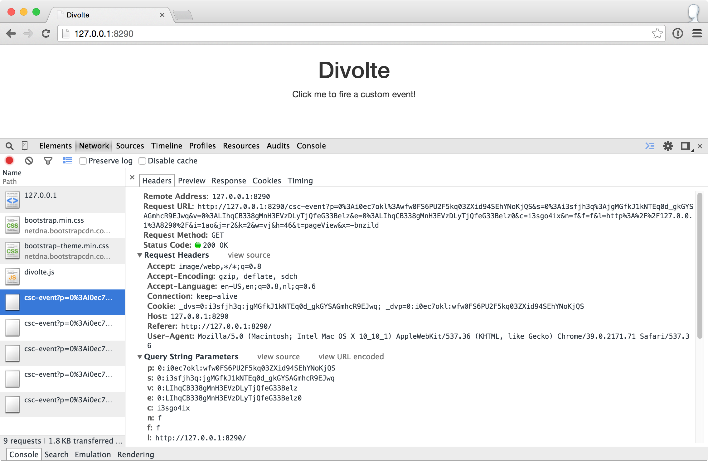

***************
Getting Started
***************

Installation
============
Divolte Collector is currently only supported on Unix-like systems, such as Linux or Mac OS X. While it should also work in Cygwin, we haven't tested this yet.

Divolte Collector requires Java 8. It is recommended that you use a recent version of Oracle JDK 8. You can download a recent version from `Oracle's website <http://www.oracle.com/technetwork/java/javase/downloads/jdk8-downloads-2133151.html>`_. Please verify that you have a correct Java version by running this command:

.. code-block:: console

  % java -version

Which should output something like this:

.. code-block:: none

  java version "1.8.0_92"
  Java(TM) SE Runtime Environment (build 1.8.0_92-b14)
  Java HotSpot(TM) 64-Bit Server VM (build 25.92-b14, mixed mode)

Next step is to download, unpack and run Divolte Collector. You can find the most recent version on our `project homepage <https://github.com/divolte/divolte-collector>`_. Download the tarball release (``.tar.gz``) from there and unpack it:

.. code-block:: console

  % tar -xzf divolte-collector-*.tar.gz
  % cd divolte-collector-*
  % touch conf/divolte-collector.conf
  % ./bin/divolte-collector

On startup, you should see output similar to this:

.. code-block:: none

  2016-08-24 14:44:56.794+02 [main] INFO  [Version]: HV000001: Hibernate Validator 5.2.4.Final
  2016-08-24 14:44:56.998+02 [main] INFO  [SchemaRegistry]: Using builtin default Avro schema.
  2016-08-24 14:44:57.102+02 [main] INFO  [SchemaRegistry]: Loaded schemas used for mappings: [default]
  2016-08-24 14:44:57.103+02 [main] INFO  [SchemaRegistry]: Inferred schemas used for sinks: [hdfs, kafka]
  2016-08-24 14:44:57.448+02 [main] INFO  [Server]: Initialized sinks: [hdfs]
  2016-08-24 14:44:57.458+02 [main] INFO  [Mapping]: Using built in default schema mapping.
  2016-08-24 14:44:57.473+02 [main] INFO  [UserAgentParserAndCache]: Using non-updating (resource module based) user agent parser.
  2016-08-24 14:44:57.699+02 [main] INFO  [UserAgentParserAndCache]: User agent parser data version: 20141024-01
  2016-08-24 14:45:00.539+02 [main] INFO  [Slf4jErrorManager]: 0 error(s), 0 warning(s), 87.7136258660508% typed
  2016-08-24 14:45:00.539+02 [main] INFO  [JavaScriptResource]: Pre-compiled JavaScript source: divolte.js
  2016-08-24 14:45:00.559+02 [main] INFO  [GzippableHttpBody]: Compressed resource: 9052 -> 4133
  2016-08-24 14:45:00.575+02 [main] INFO  [BrowserSource]: Registered source[browser] script location: /divolte.js
  2016-08-24 14:45:00.575+02 [main] INFO  [BrowserSource]: Registered source[browser] event handler: /csc-event
  2016-08-24 14:45:00.575+02 [main] INFO  [Server]: Initialized sources: [browser]
  2016-08-24 14:45:00.606+02 [main] INFO  [Server]: Starting server on localhost:8290
  2016-08-24 14:45:00.639+02 [main] INFO  [xnio]: XNIO version 3.3.6.Final
  2016-08-24 14:45:00.658+02 [main] INFO  [nio]: XNIO NIO Implementation Version 3.3.6.Final

Now, take your web browser to http://127.0.0.1:8290/ and check that you see a page there. This webpage has the Divolte Collector JavaScript tag inserted into it, so loading the page will register a pageview event with the server. Also, you can click the banner a one or more times to generate additional events or reload the page a few times. If you enable the developer tools in your browser, you can see the additional HTTP request being made by the JavaScript tag:

Looking at the data
===================

Now, go back to the console where Divolte Collector is running and hit :kbd:`Control-c` (or kill the process). You should see output similar to this:

.. code-block:: none

  ^C2016-08-24 15:24:46.359+02 [Thread-9] INFO  [Server]: Stopping HTTP server.
  2016-08-24 15:24:46.365+02 [Thread-9] INFO  [Server]: Stopping thread pools.
  2016-08-24 15:24:47.679+02 [Thread-9] INFO  [Server]: Closing HDFS filesystem connection.

When Divolte Collector shuts down it will flush and close all open files, so now we can have a look at the data that was generated. By default, with no configuration, Divolte Collector will write ``.avro`` files in :file:`/tmp` on the local filesystem. For convenience, Divolte Collector packages a version of the avro-tools that come with Apache Avro, so you can look at the contents of these files as JSON records. Try the following:

.. code-block:: bash

  % find /tmp/ -name '*divolte-tracking-*.avro' | sort | tail -n1 | xargs ./bin/avro-tools tojson --pretty

This finds a ``.avro`` file in your :file:`/tmp` directory and passes it to the :code:`avro-tools tojson` command. Depending on how many requests you made, it will display multiple records. The output for a single record should look like this:

.. code-block:: json

  {
    "detectedDuplicate" : false,
    "detectedCorruption" : false,
    "firstInSession" : true,
    "timestamp" : 1472042832571,
    "clientTimestamp" : 1472042832560,
    "remoteHost" : "127.0.0.1",
    "referer" : null,
    "location" : {
      "string" : "http://127.0.0.1:8290/"
    },
    "viewportPixelWidth" : {
      "int" : 1261
    },
    "viewportPixelHeight" : {
      "int" : 953
    },
    "screenPixelWidth" : {
      "int" : 1676
    },
    "screenPixelHeight" : {
      "int" : 1027
    },
    "partyId" : {
      "string" : "0:is8wamy0:7ApW71OgjsCmUbgmu71ggU9pTb1f9VQl"
    },
    "sessionId" : {
      "string" : "0:is8wamy0:fnXKXyXHB_Sb5mbnMocnhMDsg0JVf37C"
    },
    "pageViewId" : {
      "string" : "0:LcV0xy~Zzf2Ac5aUwxb4ZeXsFo7ZtKXm"
    },
    "eventType" : "pageView",
    "userAgentString" : {
      "string" : "Mozilla/5.0 (Macintosh; Intel Mac OS X 10_11_6) AppleWebKit/537.36 (KHTML, like Gecko) Chrome/52.0.2743.116 Safari/5
  37.36"
    },
    "userAgentName" : {
      "string" : "Chrome"
    },
    "userAgentFamily" : {
      "string" : "Chrome"
    },
    "userAgentVendor" : {
      "string" : "Google Inc."
    },
    "userAgentType" : {
      "string" : "Browser"
    },
    "userAgentVersion" : {
      "string" : "52.0.2743.116"
    },
    "userAgentDeviceCategory" : {
      "string" : "Personal computer"
    },
    "userAgentOsFamily" : {
      "string" : "OS X"
    },
    "userAgentOsVersion" : {
      "string" : "10.11.6"
    },
    "userAgentOsVendor" : {
      "string" : "Apple Computer, Inc."
    }
  }

Bring your own schema
=====================

Divolte Collector uses Avro to write data to files. Avro records require you to define a `Avro schema <http://avro.apache.org/docs/1.8.1/spec.html>`_ that defines the fields in the records. Divolte Collector comes with a `built-in generic schema <https://github.com/divolte/divolte-schema>`_ that is useful for keeping track of the basics of your clickstream data, but in most cases it makes sense to create your own schema with more specific fields that have a meaning within your website's domain. In order to achieve this two things are needed:

1. A custom Avro schema
2. A mapping that defines how to map requests onto the custom schema.

Let's create a custom schema.

Create a file called :file:`MyEventRecord.avsc` with the following contents (for example in the :file:`conf/` directory under the Divolte Collector installation):

.. code-block:: json

  {
    "namespace": "io.divolte.examples.record",
    "type": "record",
    "name": "MyEventRecord",
    "fields": [
      { "name": "timestamp",  "type": "long" },
      { "name": "remoteHost", "type": "string"},
      { "name": "eventType",  "type": ["null", "string"], "default": null },
      { "name": "location",   "type": ["null", "string"], "default": null },
      { "name": "localPath",  "type": ["null", "string"], "default": null },
      { "name": "q",          "type": ["null", "string"], "default": null },
      { "name": "n",          "type": ["null", "int"],    "default": null }
    ]
  }

This is a very minimal custom schema, but it allows us to demonstrate a very important feature in Divolte Collector: mapping. In order to use the custom schema, we need to create a mapping that maps incoming requests onto the schema fields. Create a file called :file:`mapping.groovy` with the following contents:

.. code-block:: groovy

  mapping {
    map timestamp() onto 'timestamp'
    map remoteHost() onto 'remoteHost'
    map eventType() onto 'eventType'
    map location() onto 'location'

    def locationUri = parse location() to uri
    def localUri = parse locationUri.rawFragment() to uri
    map localUri.path() onto 'localPath'

    def localQuery = localUri.query()
    map localQuery.value('q') onto 'q'
    map { parse localQuery.value('n') to int32 } onto 'n'
  }

The mapping is defined using a internal Groovy DSL in Divolte Collector. In this example we map a number of values onto fields in the Avro schema. The values for :code:`timestamp`, :code:`remoteHost` and :code:`location` are mapped directly onto fields in the schema. In the remainder of the script, we tell Divolte Collector to take the fragment of the location (the part after the ``#`` in the URL) and try to parse that into a (partial) URI again. From the result URI, we map the path onto a schema field. Subsequently, parse out the values to two query string parameters (``q`` and ``n``) and map those onto separate schema fields after trying to parse an integer out of the ``n`` parameter. The mapping DSL allows for a lot more constructs, including conditional logic, regex matching and more; see the :doc:`mapping_reference` documentation for more information on this.

Finally, we need to configure Divolte Collector to use our custom schema and mapping. Edit the (empty) :file:`divolte-collector.conf` file in the :file:`conf/` directory of your installation to resemble the following configuration (be sure to use the correct paths for the schema and mapping file that you just created):

.. code-block:: none

  divolte {
    mappings {
      my_mapping = {
        schema_file = "/path/to/divolte-collector/conf/MyEventRecord.avsc"
        mapping_script_file = "/path/to/divolte-collector/conf/mapping.groovy"
        sources = [browser]
        sinks = [hdfs]
      }
    }
  }

.. note::

  Divolte Collector configuration uses the `Typesafe Config <https://github.com/typesafehub/config>`_ library, which uses a configuration dialect called `HOCON <https://github.com/typesafehub/config/blob/master/HOCON.md>`_.

Now, once more, start Divolte Collector as before. Only this time, take your web browser to this address: `http://127.0.0.1:8290/#/fragment/path?q=textual&n=42 <http://127.0.0.1:8290/#/fragment/path?q=textual&n=42>`_. You can refresh the page a couple of times and perhaps change the query string parameter values that are in the URL to something else. After you have done one or more requests, stop Divolte Collector again (using :kbd:`Control-c`) and look at the collected data using this command again:

.. code-block:: console

  % find /tmp/ -name '*divolte-tracking-*.avro' | sort | tail -n1 | xargs ./bin/avro-tools tojson --pretty

Now, the records in the data should look like this:

.. code-block:: json

  {
    "timestamp" : 1472045780911,
    "remoteHost" : "127.0.0.1",
    "eventType" : {
      "string" : "pageView"
    },
    "location" : {
      "string" : "http://127.0.0.1:8290/#/fragment/path?q=textual&n=42"
    },
    "localPath" : {
      "string" : "/fragment/path"
    },
    "q" : {
      "string" : "textual"
    },
    "n" : {
      "int" : 42
    }
  }

As you can see, the data collected by Divolte Collector is based on the custom schema and mapping. This is very powerful because it means that the data that is being collected can be enriched on the fly with domain-specific fields that are extracted from the clickstream. This way you shouldn't need to parse out relevant bit and pieces of information afterwards. Also note that we were able to collect the entire location from the browser on the server side, including the fragment after the ``#``. This comes in very handy when working with modern JavaScript-based web applications that often depend on this part of the location for their state.

.. _collecting-clicks-label:

Collecting clicks for your own site
===================================
Underpinning the click event data collection is a small piece of JavaScript, which is called a tag. The tag needs to be inserted into every web page that you want to track. Usually, this is done by adding the tag to a template or footer file in your website. This depends largely on how your web pages are created/generated and organised. Here is an example of the Divolte Collector tag in a HTML page.

.. code-block:: html

  <html>
    <head>
      <title>My Website with Divolte Collector</title>
    </head>
    <body>
      <!-- Body content -->
      
    </body>
  </html>

The tag is the line:

.. code-block:: html

  

The tag performs a number of important tasks. It generates unique identifiers for parties, sessions, page-views and events. It collects the location, referer, screen and viewport size information from the browser sends it to the Divolte Collector server.

In order to instrument a web page of your own, insert the tag as above into the HTML code on each page. Additionally, once the Divolte Collector JavaScript is loaded in the browser it is possible to fire custom events from JavaScript in the page:

.. code-block:: javascript

  // The first argument is the event type; the second argument is
  // a JavaScript object containing arbitrary event parameters,
  // which may be omitted
  divolte.signal('myCustomEvent', { param: 'foo',  otherParam: 'bar' })

In order to use the custom events in your mapping, map values onto fields like this:

.. code-block:: groovy

  // Map the custom event parameters
  map eventParameter('param') onto 'paramField'
  map eventParameter('otherParam') onto 'otherParamField'

  /*
   * Note that custom event parameters are always interpreted
   * as string on the server side for safety. If you are sure
   * a certain parameter is always of a certain type, you need
   * to explicitly cast it in the mapping, as below.
   *
   * For more information on types and parsing, see the mapping
   * documentation
   */
  map { parse eventParameter('foo') to int32 } onto 'intField'

Writing to HDFS
===============
So far, we've been writing our data to the local filesystem in :file:`/tmp`. Although this works it not the intended use of Divolte Collector. The aim is to write the clickstream data to HDFS, such that it is safely and redundantly stored and available for processing using any tool available that knows how to process Avro files (e.g. Apache Hive or Apache Spark). It is trivial to configure Divolte Collector to write to HDFS, assuming you have a working HDFS instance setup. (Setting this up is out of the scope of this getting started guide. There are many great resources to be found on the internet about getting started with and running Hadoop and HDFS.)

Assuming you have a HDFS instance running somewhere, there are two ways of making Divolte Collector write files to it:

1. Direct configuration; or
2. Setting the :envvar:`HADOOP_CONF_DIR` environment variable to point to a directory containing valid Hadoop configuration files.

While the first option works, it is recommended to use the latter as it is easier to maintain when your HDFS parameters change over time.

First, we'll change the configuration to write files to HDFS. Add the following section to :file:`conf/divolte-collector.conf`:

.. code-block:: none

  divolte {
    global {
      hdfs {
        // Enable HDFS sinks.
        enabled = true

        // Use multiple threads to write to HDFS.
        threads = 2
      }
    }

    sinks {
      // The name of the sink. (It's referred to by the mapping.)
      hdfs {
        type = hdfs

        // For HDFS sinks we can control how the files are created.
        file_strategy {
          // Create a new file every hour
          roll_every = 1 hour

          // Perform a hsync call on the HDFS files after every 1000 records are written
          // or every 5 seconds, whichever happens first.

          // Performing a hsync call periodically can prevent data loss in the case of
          // some failure scenarios.
          sync_file_after_records = 1000
          sync_file_after_duration = 5 seconds

          // Files that are being written will be created in a working directory.
          // Once a file is closed, Divolte Collector will move the file to the
          // publish directory. The working and publish directories are allowed
          // to be the same, but this is not recommended.
          working_dir = "/divolte/inflight"
          publish_dir = "/divolte/published"
        }

        // Set the replication factor for created files.
        replication = 3
      }
    }
  }

Note that you need to create these directories prior to starting Divolte Collector. It will not startup if the directories do not exist.

If you have a working HDFS setup and a directory with the appropriate configuration files, Divolte Collector will use them automatically if a :envvar:`HADOOP_CONF_DIR` environment variable is set pointing to that directory. Alternatively, HDFS client properties can be provided in the configuration:

.. code-block:: none

  divolte {
    global {
      hdfs {
        client {
          fs.defaultFS = "hdfs://192.168.100.128:8020/"
        }
      }
    }
  }

With everything in place, start Divolte Collector again, create some events and verify that files are being created on HDFS:

.. code-block:: console

  % hadoop fs -ls /divolte/inflight/
  Found 2 items
  -rw-r--r--   1 divolte supergroup        617 2014-08-30 11:46 /divolte/inflight/20141220152512-divolte-tracking-divoltehost-1.avro.partial
  -rw-r--r--   1 divolte supergroup        617 2014-08-30 11:46 /divolte/inflight/20141220152513-divolte-tracking-divoltehost-2.avro.partial

After the rolling interval, files should show up in the publish directory with a ``.avro`` extension (without the ``.partial``). However, if a file was opened in the working directory, but no events were ever written to it (because there was no activity or otherwise), it will not be moved to the publish directory, but will be deleted entirely instead:

.. code-block:: console

  % hadoop fs -ls /divolte/published/
  Found 1 items
  -rw-r--r--   1 divolte supergroup       2321 2014-08-30 11:48 /divolte/published/20141220152513-divolte-tracking-divoltehost-2.avro

Writing to Kafka
================
Configuring Divolte Collector to write data to a Kafka topic is quite similar to the HDFS configuration:

.. code-block:: none

  divolte {
    global {
      kafka {
        // Enable Kafka flushing
        enabled = true

        // The properties under the producer key in this
        // configuration are used to create a Properties object
        // which is passed to Kafka as is. At the very least,
        // configure the broker list here. For more options
        // that can be passed to a Kafka producer, see this link:
        // http://kafka.apache.org/082/documentation.html#newproducerconfigs
        producer = {
          bootstrap.servers = "10.200.8.55:9092,10.200.8.53:9092,10.200.8.54:9092"
        }
      }
    }

    sinks {
      // The name of the sink. (It's referred to by the mapping.)
      kafka {
        type = kafka

        // This is the name of the topic that data will be produced on
        topic = divolte-data
      }
    }
  }

Data in Kafka
-------------
Avro files on HDFS are written with the schema in the header. Unfortunately Kafka doesn't really have a clear way of passing along the schema. For the messages on Kafka queues we expect the consumer to know the schema in advance, meaning that *the messages that are passed onto the queue only contain the raw bytes of the serialized Avro record without any metadata*. The key of each message is the party ID that for the event. Divolte Collector provides a small helper library to easily create Kafka consumers in Java using Avro's code generation support. There is an example Kafka consumer with step by step instruction on getting it up and running in our usage examples repository here: `https://github.com/divolte/divolte-examples/tree/master/tcp-kafka-consumer <https://github.com/divolte/divolte-examples/tree/master/tcp-kafka-consumer>`_.

Event Flows
===========

So far we've seen a single source of events being mapped to HDFS, and Kafka if you tried this. However Divolte can be
configured with multiple:

- *Sources* of events, which is where Divolte events arrive.
- *Sinks* (destinations) where Avro records can be written after they have been produced by mapping Divolte events.
- *Mappings* between sources and sinks, which controls which sources are connected to which sinks, and how the events
  are converted to Avro records.

Events flow from sources to sinks, via an intermediate mapping. Allowing multiple sources, sinks and mappings allows Divolte to support multiple sites and domains, each of which may require independent mapping. Note, however, that a sink can only support a single Avro schema: all mappings which refer to it must be configured to produce records conforming to the same Avro schema.

An event flow imposes a partial ordering on the events it receives: events from a source that have the same party identifier will be written to sinks in the same order that they were received in. (This doesn't apply to events received across different sources: even if they share the same party identifier their relative ordering is not guaranteed.)

Low-level JSON sources
----------------------

In addition to the browser sources demonstrated above, Divolte Collector supports a lower-level event source where JSON-formatted events can be posted. Let's add a new JSON source and update the mapping section to also process its events:

.. code-block:: none

  divolte {
    sources {
      // Once we specify a source, we need to specify all of them.
      // Here's the definition for the browser source we've been using until now.
      browser = {
        type = browser
      }
      // Here's the low-level JSON source we're adding.
      json = {
        type = json
        event_path = /json
      }
    }
    mappings {
      my_mapping = {
        schema_file = "/path/to/divolte-collector/conf/MyEventRecord.avsc"
        mapping_script_file = "/path/to/divolte-collector/conf/mapping.groovy"
        // In addition to mapping events from the browser source, we also map from the new JSON source.
        sources = [browser, json]
        sinks = [hdfs]
      }
    }
  }

At this point all the existing browser-based examples should still work, but you can now also submit a JSON-formatted event:

.. code-block:: console

  % curl 'http://localhost:8290/json?p=0:is8tiwk4:GKv5gCc5TtrvBTs9bXfVD8KIQ3oO~sEg' \
      --dump-header - \
      --header 'Content-Type: application/json' \
      --data '
  {
    "session_id": "0:is8tiwk4:XLEUVj9hA6AXRUOp2zuIdUpaeFOC~7AU",
    "event_id": "AruZ~Em0WNlAnbyzVmwM~GR0cMb6Xl9s",
    "is_new_party": true,
    "is_new_session": true,
    "client_timestamp_iso": "2016-08-24T13:29:39.412+02:00",
    "event_type": "anEvent"
  }'

As before we can display the events that have been collected:

.. code-block:: console

  % find /tmp/ -name '*divolte-tracking-*.avro' | sort | tail -n1 | xargs ./bin/avro-tools tojson --pretty

There should be an event that looks something like:

.. code-block:: json

  {
    "timestamp" : 1472046897112,
    "remoteHost" : "127.0.0.1",
    "eventType" : {
      "string" : "anEvent"
    },
    "location" : null,
    "localPath" : null,
    "q" : null,
    "n" : null
  }

Our mapping was able to produce an event based on the JSON event, but many fields don't have a value because they are only supplied by browser events. For low-level events instead:

1. Custom data instead needs to be supplied in a ``parameters`` JSON property;
2. The mapping needs to be updated, as mentioned briefly in the :ref:`collecting-clicks-label` section above.

What's next?
============
* Once you are collecting data to either HDFS or Kafka, see our `examples <https://github.com/divolte/divolte-examples>`_ to learn how to use your clickstream data in tools like Apache Spark, Apache Hive or Impala or build near real-time consumers for Apache Kafka with your Divolte Collector data.
* Learn more about custom schemas and mapping in the :doc:`mapping_reference` documentation.
* Planning a production deployment? See the :doc:`deployment` guide.
* Review all the configuration options in the :doc:`configuration` documentation.
