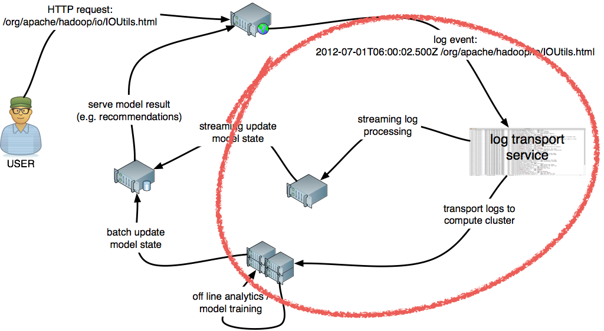
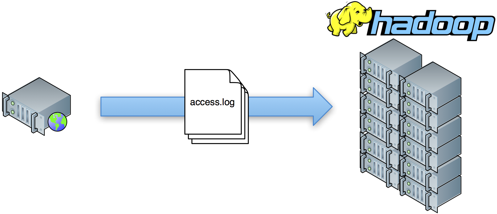
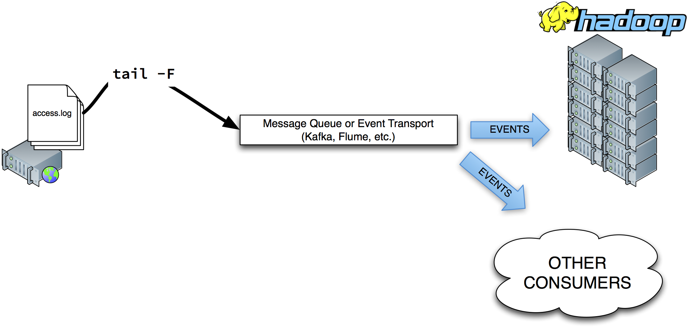

************
Introduction
************

Divolte Collector is a solution for collecting `clickstream data <https://en.wikipedia.org/wiki/Clickstream>`_ from website users and subsequently store that data into `Hadoop <http://hadoop.apache.org/>`_ as `Avro <http://avro.apache.org/>`_ files and push individual click events as messages onto a `Kafka <http://kafka.apache.org/>`_ topic. This is useful in scenarios where you need to perform offline and/or near real-time processing and analysis on user behavior in the form of click event data, such as when building recommender systems, personalization of websites or plain analytics on user behavior on a website.

Several solutions exist already to this problem (hosted solution like Google Analytics, Omniture, or open source systems such as Piwik). Here's what makes Divolte Collector different:

* Built from the ground up for Hadoop and Kafka (Divolte Collector writes directly to HDFS and Kafka; no plugins or integrations).
* The collected data has a user defined schema, with domain specific fields in Apache Avro records; Divolte Collector allows for schema evolution as well.
* The above means that click event URLs are parsed and transformed on the fly; this is done based on rich configuration, so no custom coding required.
* Because Divolte Collector is built for Hadoop and Kafka, it comes with several working examples for using your data in `Apache Spark <https://github.com/divolte/divolte-examples/tree/master/spark>`_, `Apache Hive <https://github.com/divolte/divolte-examples/tree/master/hdfs-hive>`_, `iPython notebook with PySpark <https://github.com/divolte/divolte-examples/tree/master/pyspark>`_ and using a `Kafka Consumer <https://github.com/divolte/divolte-examples/tree/master/tcp-kafka-consumer>`_. Because Avro records are used, these use cases are supported without requiring log file parsing or complex integration.

The remainder of this chapter introduces the concept of clickstream collection and the way Divolte Collector solves this problem. If you'd rather get hands-on immediately, why not jump to the :doc:`getting_started` guide.

Capturing clickstream
=====================
Click events are the primary data source in web optimization solutions. These events are often captured through log (file) processing and pushed down to systems for both batch and near real-time processing. Capturing the click event data from web visitors in order to analyze and act upon user behavior is not a new problem. Over time it has been solved in different ways, all with their own advantages and drawbacks. First, let's look at a typical architecture for building web optimization solutions:

In the above diagram, the part marked in the red outline is the problem that Divolte Collector focuses on: the collection, parsing, storing and streaming of click events.

The simplest solution to this problem (and also the one that most of the early Hadoop use cases were based on), is to simply collect the web server log files and push them onto HDFS for further processing:

This method has some drawbacks, however:

* It is inherently batch oriented; no near real-time flow.
* No schema. Log events are just lines in the web servers log format.

  * This requires an initial job to just parse out the relevant information.
  * Usually multiple versions of this parser are needed.

* Requires sessionizing.
* Logs contain a lot of non-user requests, such as bots, crawlers, health checks, etc.

In order to overcome some of these problems, the next generation of log event collection setups would stream individual log events instead of moving entire log files around. This can be solved using a combination of tools like `syslog <http://en.wikipedia.org/wiki/Syslog>`_, `syslog-ng <http://en.wikipedia.org/wiki/Syslog-ng>`_ and `Apache Flume <http://flume.apache.org/>`_.

While this adds streaming processing to the mix, some drawbacks still exist: there is no schema, you still need a parser and it suffers from bots and crawlers alike. Modern solutions take a different approach: instead of using the server side log event as the source of event data an event is generated on the client side and delivered to a separate back-end service to handle the event logging. This method is often called `tagging (or Web Beacon, if you're Wikipedia) <http://en.wikipedia.org/wiki/Web_beacon>`_. In this scenario, each web page contains a special piece of JavaScript code that calls a back-end service to generate the actual event:

.. image:: images/tag-based-collection.png
   :alt: Modern click event collection

This approach has several benefits:

* Less traffic from bots and crawlers is seen in the event stream (most bots do not evaluate JavaScript).
* Event logging is asynchronous; it doesn't compete with your web servers cycles or bandwidth.

  * This makes it easier to do in-flight processing as it doesn't influence the performance of the web page itself.

* It allows for custom events fired from JavaScript based on interactions that would otherwise not reach the server side.
* JavaScript has access to some properties that the web server doesn't see:

  * Screen resolution of the client
  * Viewport site

* The JavaScript can manage party and session identifiers on the client side, eliminating the need to sessionize data after collection.

This is the way Divolte Collector works. In the above diagram, the components in the red outlines are the core parts of Divolte Collector: a JavaScript tag that goes in each web page and a collection server that enriches events and writes them as Avro records to HDFS files and Kafka messages.

Features
========
In addition to collecting click events, Divolte Collector provides a number of welcome features:

* Single line JavaScript deployment:

  .. code-block:: html

    

* Mapping clickstream data onto a domain specific (Avro) schema; on the fly parsing

  * Comes with a built in default schema and mapping for basic, zero-config deployment

* Horizontally scalable behind a load balancer.
* Performs in-stream deduplication of events, in the case a browser fires the same event multiple times or other sources of duplicates exist. (This happens more often than you think on the internet.)
* Corrupt request detection for similar issues as above.
* Generates unique identifiers:

  * Party ID: a long lived cookie that is set on the client
  * Session ID: a cookie that expires after 30 minutes of inactivity
  * Pageview ID: a unique identifier for each pageview and subsequent custom events fired from the same page
  * Event ID: a unique identifier for each event

* User agent parsing: the user agent string is parsed on the fly and the resulting fields (e.g. operating system, browser type, device type) can be mapped onto the schema.
* On the fly geolocation lookup based on IP address can be done using the `Maxmind databases <https://www.maxmind.com/en/geoip2-databases>`_.
* Handle Google Chrome's pre-rendering and many other browser quirks; this prevents phantom events where the user actually never saw the page.
* Fire custom events with custom parameters from JavaScript in your pages

  * The custom event parameters can be mapped directly to your schema.

* It is possible to generate page view IDs on the server side when using dynamically generated pages.

  * This allows to perform server side logging which can later be correlated with client-side events.

* Divolte Collector comes with additional libraries to make it very easy to create custom Kafka consumers for near real-time processing and to work with your data in Apache Spark (Streaming).
* Built with performance in mind: in testing on commodity hardware, Divolte Collector should be network IO bound before anything else.

  * In the default configuration, it handles about 12K-15K requests per request processing thread per second on a Linux VM running on a laptop.

Requirements
============
Divolte Collector is written in pure Java and runs on any OS that supports the latest JVM. For best result, we recommend running on Linux.

* JDK, version 8 or above (Oracle's JDK is recommended)
* At least 1GB available RAM; depending on configuration
* Hadoop 2.0 or above (optional, see below)

  * Tested to work against: CDH, HDP and MapR

* Apache Kafka 0.8 or above (optional, see below)
* Load balancer with SSL offloading to support HTTPS

.. note::

  Divolte Collector can be configured to send data to either HDFS or Kafka or both. It's not required to use both. When running locally for testing, it can also write to the local file system.
