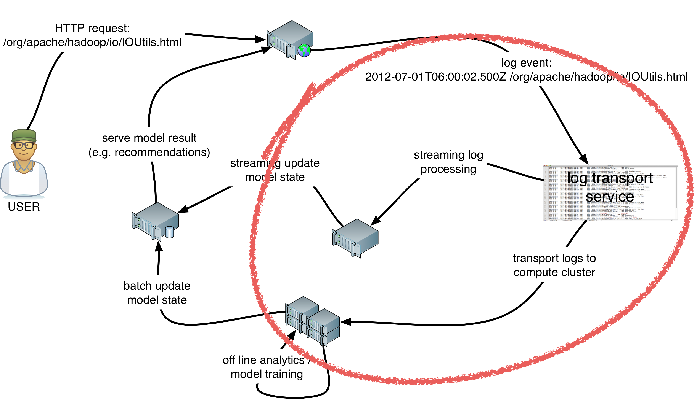

************
Introduction
************

Analyzing your clickstream data always starts with the gathering of data. The easiest way to start collecting data about what users do on your website is getting the webservers access logs into an environment suitable to do analytics.

The next step to get value out of these logs is to parse the logfile format into something more suitable for analytics. The problem here is that the logs contain the full url's and you need to extract the usefull parts out of that url.
every time the url structure of your site changes you need to create a new iteration of your parser logic to cope with the new as well as with the old structure.

Getting your clickstream data into the analytics environment (Hadoop for example) is one thing and gives you the ability to get some value out of your data. But it's still a batch oriented process. So you need a seperate stream to get realtime information from your data. 
Most of the time tools like Flume or syslog-ng are used to get a seperate stream of realtime clickstream data. This second flow again needs to be parsed by the same parser logic.

Requirements
============
- Java8
- Some memory
- A working Hadoop cluster (HDFS)
- A working Kafka cluster
- A load balancer with SSL off loading
