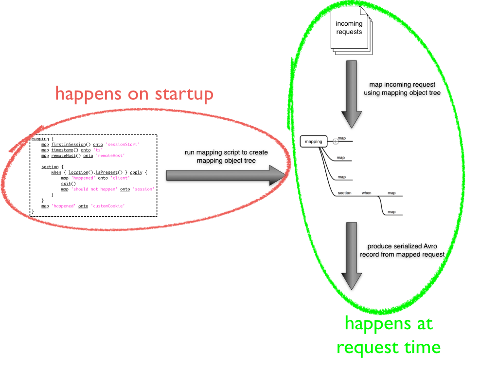

*******
Mapping
*******

Mapping in Divolte Collector is the definition that determines how incoming events are translated into Avro records conforming to a schema. This definition is constructed using a `Groovy\ <http://groovy.codehaus.org/>`_\ -based DSL (Domain-Specific Language).

Why mapping?
============
Most clickstream data collection services or solutions use a canonical data model that is specific to click events and related properties. Things such as location, referrer, remote IP address, path, etc. are all properties of a click event that come to mind. While Divolte Collector exposes all of these fields just as well, it is our vision that this is not enough to make it easy to build online and near real-time data driven products within specific domains and environments. For example, when working on a system for product recommendation, the notion of a URL or path for a specific page is completely in the wrong domain; what you care about in this case is likely a product ID and probably a type of interaction (e.g. product page view, large product photo view, add to basket, etc.). It is usually possible to extract these pieces of information from the clickstream representation, which means custom parsers have to be created to parse this information out of URLs, custom events from JavaScript and other sources. This means that whenever you work with the clickstream data, you have to run these custom parsers initially in order to get meaninful, domain specific information from the data. When building real-time systems, it normally means that this parser has to run in multiple locations: as part of the off line processing jobs and as part of the real-time processing.

With Divolte Collector, instead of writing parsers and working with the raw clickstream event data in your processing, you define mappings that allows Divolte Collector to do all the required parsing on the fly as events come in and subsequently produce structured records with a schema to use in further processing. This means that all data that comes in can already have the relevant domain specific fields populated. Whenever the need for a new extracted piece of information arises, you can update the mapping to include the new field in the newly produced data. The older data that lacks newly additional fields can co-exist with newer data that does have the additional fields through a process called schema evolution. This is supported by Avro's ability to read data with a different schema from the one that the data was written with. (This is implemented at read-time using a process called `schema resolution <https://avro.apache.org/docs/1.8.1/spec.html#Schema+Resolution>`_.)

The goal of the mapping is to get rid of log file or URL parsing on collected data after it is published. The event stream from Divolte Collector should have all the domain specific fields to support you use cases directly.

Understanding the mapping process
---------------------------------
Before you dive in to creating your own mappings, it is important to understand a little bit about how a mapping is actually performed. **The most notable thing to keep in mind is that a mapping script that you provide is not evaluated at request time for each event.** Instead a mapping is evaluated only once during startup and *declares* how the actual mapping should take place.

Schema evolution and default values
-----------------------------------
Schema evolution is the process of changing the schema over time as requirements change. For example when a new feature is added to your website, you add additional fields to the schema that contain specific information about user interactions with this new feature. In this scenario, you would update the schema to have these additional fields, update the mapping and then run Divolte Collector with the new schema and mapping. This means that there will be a difference between data that was written prior to the update and data that is written after the update. Also, it means that after the update, there can still be consumers of the data (from HDFS or Kafka) that still use the old schema. In order to make sure that this isn't a problem, the readers with the old schema need to be able to read data written with the new schema and readers with the new schema should also still work on data written with the old schema.

Luckily, Avro supports both of these cases. When reading newer data with an older schema, the fields that are not present in the old schema are simply ignored by the reader. The other way around is slightly trickier. When reading older data with a new schema, Avro will fill in the default values for fields that are present in the schema but not in the data. *This is provided that there is a default value.* Basically, this means that it is recommended to always provide a default value for all your fields in the schema. In case of nullable fields, the default value could just be null.

One other reason to always provide a default value is that Avro does not allow to create records with missing values if there are no default values. As a result of this, fields that have no default value always must be populated in the mapping, otherwise an error will occur. This is problematic if the mapping for some reason fails to set a field (e.g. because of a user typing in a non-conforming location in the browser).

In addition to introducing new fields with defaults, other forms of changes such as renaming and type changes can be permitted under some circumstances. For full details on the changes that are permitted and how the writing and reading schemas are reconciled refer to the `Avro documentation on schema resolution <https://avro.apache.org/docs/1.8.1/spec.html#Schema+Resolution>`_.

Mapping DSL
===========
Mappings are specified by Groovy scripts that are compiled and run by Divolte Collector on startup. Each mapping script is written in the mapping DSL. The result of running this script is a mapping that Divolte Collector can use to map incoming events from its configured sources onto an Avro schema.

The values that are available on an event depend on the type of source that produced it. Currently browser events make more values available than events produced by JSON sources.

Built-in default mapping
------------------------
Divolte Collector comes with a built-in default schema and mapping. A mapping will use these if the mapping schema or script file are not specified. The default mapping is intended to map events from a browser source and will map most things that you would expect from a clickstream data collector. The Avro schema that is used can be found in the `divolte-schema Github repository <https://github.com/divolte/divolte-schema>`_. The following mappings are present in the default mapping:

===============================  =================
Mapped value                     Avro schema field
===============================  =================
`duplicate`_                     detectedDuplicate
`corrupt`_                       detectedCorruption
`firstInSession`_                firstInSession
`timestamp`_                     timestamp
`clientTimestamp`_               clientTimestamp
`remoteHost`_                    remoteHost
`referer`_                       referer
`location`_                      location
`viewportPixelWidth`_            viewportPixelWidth
`viewportPixelHeight`_           viewportPixelHeight
`screenPixelWidth`_              screenPixelWidth
`screenPixelHeight`_             screenPixelHeight
`partyId`_                       partyId
`sessionId`_                     sessionId
`pageViewId`_                    pageViewId
`eventType`_                     eventType
`userAgentString`_               userAgentString
`User agent name`_               userAgentName
`User agent family`_             userAgentFamily
`User agent vendor`_             userAgentVendor
`User agent type`_               userAgentType
`User agent version`_            userAgentVersion
`User agent device category`_    userAgentDeviceCategory
`User agent OS family`_          userAgentOsFamily
`User agent OS version`_         userAgentOsVersion
`User agent OS vendor`_          userAgentOsVendor
===============================  =================

The default schema is not available as a mapping script. Instead, it is hard coded into Divolte Collector. This allows Divolte Collector to do something useful out-of-the-box without any complex configuration.

Values, fields and mappings
---------------------------
Mapping involves three main concepts: values, fields and mappings.

A *value* is something that is extracted from the incoming event (e.g. the location or a HTTP header value) or is derived from another value (e.g. a query parameter from the location URI). Values in the mapping are produced using calls to functions that are built into the mapping DSL. Below is the complete documentation for all values that can be produced. One example of such a function call would be calling :code:`location()` for the location value or :code:`referer()` for the referrer value of the event.

A *field* is a field in the Avro record that will be produced as a result of the mapping process. The type of a field is defined by the Avro schema that is used. Mapping is the process of mapping values extracted from the event onto fields in the Avro record.

A *mapping* is the piece that tells Divolte Collector which values need to be mapped onto which fields. The mapping DSL has a built in construct for this, explained below.

Mapping values onto fields (:code:`map`)
^^^^^^^^^^^^^^^^^^^^^^^^^^^^^^^^^^^^^^^^
The simplest possible mapping is mapping a simple value onto a schema field. The syntax is as follows:

.. code-block:: groovy

  map location() onto 'locationField'

Alternatively, the :code:`map` function takes a closure as first argument, which can come in handy when the value is the result of several operations or a more complex construct, such as this example where we take a query parameter from the location and parse it as an integer:

.. code-block:: groovy

  map {
    def u = parse location() to uri          // Parse the URI out of the location
    parse u.query().value('n') to int32      // Take the n query parameter and try to parse an int out of it
  } onto 'intField'

In Groovy the last statement in a closure becomes the return value for the closure. So in the closure above, the value returned by the :code:`parse` call is the result of the entire closure. This is in turn mapped onto the :code:`intField` field of the Avro record.

Apart from mapping values onto fields, it is also possible to map a literal onto a field:

.. code-block:: groovy

  map 'string literal' onto 'stringField'
  map true onto 'booleanField'

This is most often used in combination with `Conditional mapping (when)`_ as in this example:

.. code-block:: groovy

  when referer().isAbsent() apply {           // Only apply this mapping when a referer is absent
    map true onto 'directTraffic'
  }

Value presence
""""""""""""""
Not all values are present in each event. For example, when using a custom cookie value there could be incoming events where the cookie is not sent by the client. In this case the cookie value is said to absent. Similarly, events from a JSON source do not have a location value; this is specific to events from a browser source.

Divolte Collector will never actively set an absent value. Instead for absent values it does nothing at all: the mapped field is not set on the Avro record. When values that are absent are used in subsequent expressions the derived values will also be absent. In the following example the :code:`intField` field will never be set because the incoming request has no referrer. This is not an error:

.. code-block:: groovy

  def u = parse referer() to uri              // parse a URI out of the referer
  def q = u.query()                           // parse the query string of the URI
  def i = parse q.value('foo') to int32       // parse a int out of the query parameter 'foo'
  map i onto 'intField'                       // map it onto the field 'intField'

Because absent values result in fields not being set your schema must have default values for all fields that are used for mappings where the value can be absent. In practice, it is recommended to always use default values for all fields in your schema.

Types
^^^^^
Values in a mapping are typed and the value type must match the type of the Avro field that they are mapped onto. Divolte Collector checks for type compatibility during startup and will report an error if there is a mismatch. The type for a value can be found in the documentation below.

Below is a table of all types that can be produced in a mapping and the corresponding Avro types that match them:

+----------------------------------+------------------------------------------------------------------------+
| Type                             | Avro type                                                              |
+==================================+========================================================================+
| :code:`String`                   | .. code-block:: json                                                   |
|                                  |                                                                        |
|                                  |   { "name": "fieldName", "type": ["null","string"], "default": null }  |
+----------------------------------+------------------------------------------------------------------------+
| :code:`Boolean`                  | .. code-block:: json                                                   |
|                                  |                                                                        |
|                                  |   { "name": "fieldName", "type": ["null","boolean"], "default": null } |
+----------------------------------+------------------------------------------------------------------------+
| :code:`int`                      | .. code-block:: json                                                   |
|                                  |                                                                        |
|                                  |   { "name": "fieldName", "type": ["null","int"], "default": null }     |
+----------------------------------+------------------------------------------------------------------------+
| :code:`long`                     | .. code-block:: json                                                   |
|                                  |                                                                        |
|                                  |   { "name": "fieldName", "type": ["null","long"], "default": null }    |
+----------------------------------+------------------------------------------------------------------------+
| :code:`float`                    | .. code-block:: json                                                   |
|                                  |                                                                        |
|                                  |   { "name": "fieldName", "type": ["null","float"], "default": null }   |
+----------------------------------+------------------------------------------------------------------------+
| :code:`double`                   | .. code-block:: json                                                   |
|                                  |                                                                        |
|                                  |   { "name": "fieldName", "type": ["null","double"], "default": null }  |
+----------------------------------+------------------------------------------------------------------------+
| :code:`Map<String,List<String>>` | .. code-block:: json                                                   |
|                                  |                                                                        |
|                                  |   {                                                                    |
|                                  |     "name": "fieldName",                                               |
|                                  |     "type": [                                                          |
|                                  |       "null",                                                          |
|                                  |       {                                                                |
|                                  |         "type": "map",                                                 |
|                                  |         "values": {                                                    |
|                                  |           "type": "array",                                             |
|                                  |           "items": "string"                                            |
|                                  |         }                                                              |
|                                  |       }                                                                |
|                                  |     ],                                                                 |
|                                  |     "default": null                                                    |
|                                  |   }                                                                    |
+----------------------------------+------------------------------------------------------------------------+
| :code:`List<String>`             | .. code-block:: json                                                   |
|                                  |                                                                        |
|                                  |   {                                                                    |
|                                  |     "name": "fieldName",                                               |
|                                  |     "type":                                                            |
|                                  |       [                                                                |
|                                  |         "null",                                                        |
|                                  |         {                                                              |
|                                  |           "type": "array",                                             |
|                                  |           "items": "int"                                               |
|                                  |         }                                                              |
|                                  |       ],                                                               |
|                                  |     "default": null                                                    |
|                                  |   }                                                                    |
+----------------------------------+------------------------------------------------------------------------+
| JSON (:code:`JsonNode`)          | Must match the structure of the JSON fragment.                         |
|                                  | See :ref:`mapping-json-label`.                                         |
+----------------------------------+------------------------------------------------------------------------+

Casting/parsing
"""""""""""""""
Many of the simple values that can be extracted from an event are strings. Sometimes these values are not intended to be strings. Because type information about things like query parameters or path components is not present in a HTTP request, Divolte Collector can only treat these values as strings. It is, however, possible to parse a string to a primitive or other type in the mapping using this construct:

.. code-block:: groovy

  def i = parse stringValue to int32

In the example above, :code:`stringValue` is a string value and the result value, assigned to :code:`i`, will be of type :code:`int`.

.. note::

  This is not casting, but string parsing. If the string value cannot be parsed to an integer (because it is not a number) the resulting value will be absent, but no error occurs.

A more complete example is this:

.. code-block:: groovy

  def u = parse referer() to uri              // u is of type URI (which is not mappable)
  def q = u.query()                           // q is of type map<string,list<string>>
  def s = q.value('foo')                      // s is of type string if query parameter foo contained a integer number
  def i = parse s to int32                    // i is of type int
  map i onto 'intField'                       // map it onto the field 'intField'

Because :code:`int`, :code:`long`, :code:`Boolean`, etc. are reserved words in Groovy, the mapping DSL uses aliases for parsing. The following table lists the types that can be used for parsing and the corresponding mapping types:

+-------------------+-------------------+
| Parsing alias     | Type              |
+===================+===================+
| :code:`int32`     | :code:`int`       |
+-------------------+-------------------+
| :code:`int64`     | :code:`long`      |
+-------------------+-------------------+
| :code:`fp32`      | :code:`float`     |
+-------------------+-------------------+
| :code:`fp64`      | :code:`double`    |
+-------------------+-------------------+
| :code:`bool`      | :code:`Boolean`   |
+-------------------+-------------------+
| :code:`uri`       | :code:`URI`       |
+-------------------+-------------------+

.. _mapping-json-label:

Mapping JSON (:code:`JsonNode`) to Avro fields
""""""""""""""""""""""""""""""""""""""""""""""

Some expressions, for example, :code:`eventParameters()` (and its :code:`path()` method), produce a :code:`JsonNode` value that represents JSON supplied by a client. Because Avro doesn't have a type for handling arbitrary JSON data, a *compatible* Avro type must be chosen to match the expected structure of the JSON from the client. The following table lists the rules for compatibility between JSON values and Avro types.

+-------------------+---------------------------------------------------------------------------+
| Avro type         | JSON value                                                                |
+===================+===========================================================================+
| | :code:`null`    | JSON's :code:`null` value                                                 |
+-------------------+---------------------------------------------------------------------------+
| | :code:`boolean` | A JSON boolean, or a string if it can be parsed as a boolean.             |
+-------------------+---------------------------------------------------------------------------+
| | :code:`int`     | A JSON number, or a string if it can be parsed as a number.               |
| | :code:`long`    | Fractional components are truncated for :code:`float` and :code:`double`. |
+-------------------+---------------------------------------------------------------------------+
| | :code:`float`   | A JSON number, or a string if it can be parsed as a number.               |
| | :code:`double`  | Note that full floating-point precision may not be preserved.             |
+-------------------+---------------------------------------------------------------------------+
| | :code:`bytes`   | A JSON string, with BASE64 encoded binary data.                           |
+-------------------+---------------------------------------------------------------------------+
| | :code:`string`  | A JSON string, number or boolean value.                                   |
+-------------------+---------------------------------------------------------------------------+
| | :code:`enum`    | A JSON string, so long as the it's identical to one of the enumeration's  |
|                   | symbols. (If not, the value will be treated as :code:`null`.              |
+-------------------+---------------------------------------------------------------------------+
| | :code:`record`  | A JSON object, with each property corresponding to a field in the record. |
|                   | (Extraneous properties are ignored.) The property values and field types  |
|                   | must also be compatible.                                                  |
+-------------------+---------------------------------------------------------------------------+
| | :code:`array`   | A JSON array. Each element of the JSON array must be compatible with the  |
|                   | type declared for the Avro array.                                         |
+-------------------+---------------------------------------------------------------------------+
| | :code:`map`     | A JSON object, with each property being an entry in the map. Property     |
|                   | names are used for keys, and the values must be compatible with the Avro  |
|                   | type for the map values.                                                  |
+-------------------+---------------------------------------------------------------------------+
| | :code:`union`   | Only trivial unions are supported of :code:`null` with another type. The  |
|                   | JSON value must either be null or compatible with the other union type.   |
+-------------------+---------------------------------------------------------------------------+
| | :code:`fixed`   | The same as :code:`bytes`, as above. Data beyond the declared length will |
|                   | be truncated.                                                             |
+-------------------+---------------------------------------------------------------------------+

In addition to these compatibility rules, trivial array wrapping and unwrapping will be performed if necessary:

* If the Avro type specifies an array, any JSON value compatible with the type of the array elements will be wrapped as a single-element array.
* If the Avro type is not an array, a JSON array containing a single element that is compatible will be unwrapped.

For example, a shopping basket could be supplied as the following JSON:

.. code-block:: json

  {
    "total_price": 184.91,
    "items": [
      { "sku": "0886974140818", "count": 1, "price_per": 43.94 },
      { "sku": "0094638246817", "count": 1, "price_per": 22.99 },
      { "sku": "0093624979357", "count": 1, "price_per": 27.99 },
      { "sku": "8712837825207", "count": 1, "price_per": 89.99 }
    ]
  }

This could be mapped using the following Avro schema:

.. code-block:: json

  {
    "type": [
      "null",
      {
        "name": "ShoppingBasket",
        "type": "record",
        "fields": [
          { "name": "total_price", "type": "float" },
          {
            "name": "items",
            "type": {
              "type": "array",
              "items": {
                "type": "record",
                "name": "LineItem",
                "fields": [
                  { "name": "sku",       "type": "string" },
                  { "name": "count",     "type": "int"    },
                  { "name": "price_per", "type": "double" }
                ]
              }
            }
          }
        ]
      }
    ],
    "default": null
  }

The Avro field will remain unchanged if mapping fails at runtime because the JSON value cannot be mapped onto the specified Avro type. (The complete record may subsequently be invalid if the field was mandatory.)

.. note::

   Unlike most mappings, schema compatibility for JSON mappings cannot be checked on startup because
   compatibility depends on the JSON supplied with each individual event.

Conditional mapping (:code:`when`)
^^^^^^^^^^^^^^^^^^^^^^^^^^^^^^^^^^
Not all incoming requests are the same and usually, different types of requests require different values to be extracted and different fields to be set. This can be achieved using conditional mapping. With conditional mapping any boolean value can be used to conditionally apply a part of the mapping script. This can be done using the following syntax:

.. code-block:: groovy

  when conditionBooleanValue apply {
    // Conditional mapping go here
    map 'value' onto 'fieldName'
  }

A more concrete example of using this construct would be:

.. code-block:: groovy

  when referer().isAbsent() apply {
    map true onto 'directTraffic'
  }

Here we check whether the referer value is absent and if so, map a literal value onto a boolean field.

As an alternative syntax, it is possible to use a closure that produces the boolean value as well, just like in `Mapping values onto fields (map)`_. In this example we check if a query parameter called :code:`clientId` is present in the location and on that condition perform a mapping:

.. code-block:: groovy

  when {
    def u = parse location() to uri
    u.query().value('clientId').isPresent()
  } apply {
    map true onto 'signedInUser'
  }

Conditions
""""""""""
Any boolean value can be used as a condition. In order to be able to create flexible conditional mappings, the mapping DSL provides a number of methods on values that return booleans useful in conditional mappings, such as equality comparisons and boolean logic:

+-------------------------------------------------+----------------------------------------------------------------+
| Condition                                       | Description                                                    |
+=================================================+================================================================+
| :samp:`{value}.isPresent()`                     | True if the value is present. See: `Value presence`_           |
+-------------------------------------------------+----------------------------------------------------------------+
| :samp:`{value}.isAbsent()`                      | True if the value is absent. See: `Value presence`_            |
+-------------------------------------------------+----------------------------------------------------------------+
| :samp:`{value}.equalTo({otherValue})`           | True if both values are equal. Values must be of the same type.|
+-------------------------------------------------+----------------------------------------------------------------+
| :samp:`{value}.equalTo({'literal'})`            | True if the value is equal to the given literal. Non-string    |
|                                                 | types are supported as well.                                   |
+-------------------------------------------------+----------------------------------------------------------------+
| :samp:`{booleanValue}.and({otherBooleanValue})` | True if both booleans are true.                                |
+-------------------------------------------------+----------------------------------------------------------------+
| :samp:`{booleanValue}.or({otherBooleanValue})`  | True if either or both of the boolean values are true.         |
+-------------------------------------------------+----------------------------------------------------------------+
| :samp:`not {booleanValue}`                      | True if the boolean value is false.                            |
+-------------------------------------------------+----------------------------------------------------------------+
| :samp:`{regexMatcherValue}.matches()`           | True if the regular expression matches the value. See:         |
|                                                 | `Regular expression matching`_.                                |
+-------------------------------------------------+----------------------------------------------------------------+

Sections and short circuiting
^^^^^^^^^^^^^^^^^^^^^^^^^^^^^
Sections are useful for grouping together parts of the mapping that form a logical subset of the entire mapping. In addition to grouping it is possible to conditionally stop processing a section prematurely. Sections are defined using the :code:`section` keyword followed by a closure that contains the section:

.. code-block:: groovy

  section {
    // Section's mappings go here
    map 'value' onto 'field'
  }

Function: :code:`exit()`
""""""""""""""""""""""""
The :code:`exit()` function will, at any point, break out of the enclosing section or, when no enclosing section can be found, break out of the entire mapping script. This can be used to conditionally break out of a section. For example to create a type of first-match-wins scenario:

.. code-block:: groovy

  section {
    def u = parse location() to uri

    when u.path().equalTo('/home.html') apply {
      map 'homepage' onto 'pageType'
      exit()
    }

    when u.path().equalTo('/contact.html') apply {
      map 'contactpage' onto 'pageType'
      exit()
    }

    map 'other' onto 'pageType'
  }

  // other mappings here

There is a optional shorthand syntax for conditionally exiting from a section which leaves out the :code:`apply` keyword and closure:

.. code-block:: groovy

  when referer().isAbsent() exit()

Function: :code:`stop()`
""""""""""""""""""""""""
The :code:`stop()` function will, at any point, stop *all* further processing and break out of the entire mapping script. This is typically applied conditionally. Generally, it is safer to use sections and :code:`exit()` instead. Use with care. The :code:`stop()` function can also be used conditionally, just as anything else:

.. code-block:: groovy

  when referer().isAbsent() {
    stop()
  }

Or, using shorthand syntax:

.. code-block:: groovy

  when referer().isAbsent stop()

A word on groovy
----------------
Groovy is a dynamic language for the JVM. This means, amongst other things, that you don't have to specify the types of variables:

.. code-block:: groovy

  def i = 40
  println i + 2

The above snippet will print out 42 as you would expect. Note two things: we never specified that variable i is an int and also, we are not using any parentheses in the :code:`println` function call. Groovy allows to leave out the parentheses in most function and method calls. The code above is equivalent to this snippet:

.. code-block:: groovy

  def i = 42
  println(i + 2)

This in turn is equivalent to this:

.. code-block:: groovy

  def i = 42
  println(i.plus(2))

This works well when chaining single argument methods. However, this can be more problematic with nested method calls. Suppose we have a function called :samp:`increment({x})` which increments the :code:`x` argument by 1, so :code:`increment(10)` will return 11. The following will not compile:

.. code-block:: groovy

  println increment 10

However this will:

.. code-block:: groovy

  println(increment(10))

Yet this won't:

.. code-block:: groovy

  println(increment 10)

In the Divolte Collector mapping DSL, it is sometimes required to chain method calls. For example when using the result of a casting operation in a mapping. We solve this by accepting a closure that produces a value as result:

.. code-block:: groovy

  map { parse cookie('customer_id') to int32 } onto 'customerId'

This way you don't have to add parentheses to all intermediate method calls and we keep the syntax fluent. If you follow these general guidelines, you should be safe:

* When calling methods that produce a value, always use parentheses. For example: :code:`location()`, :code:`referer()`, :code:`partyId()`
* When deriving a condition or other value from a method that produces a value, also use parentheses. For example:

  .. code-block:: groovy

    when location().equalTo('http://www.example.com/') apply {
      ...
    }

    map cookie('example').isPresent() onto 'field'

    map parsedUri.query().value('foo') onto 'field'

* When parsing or matching on something, extract it to a variable before using it. This also improves readability:

  .. code-block:: groovy

    def myUri = parse location() to uri
    when myUri.query().value('foo').isPresent() apply { ... }

    def myMatcher = match '^/foo/bar/([a-z]+)/' against myUri.path()
    when myMatcher.matches() apply { ... }

* When casting inline, use the closure syntax for mapping or conditionals:

  .. code-block:: groovy

    map { parse cookie('example') to int32 } onto 'field'

Simple values
^^^^^^^^^^^^^
Simple values are pieces of information that are directly extracted from the event without any processing. You can map simple values directly onto fields of the correct type or you can use them in further processing, such as matching againast a regular expression or URI parsing.

.. _location:

Simple value: :code:`location()`
""""""""""""""""""""""""""""""""
:Usage:

  .. code-block:: groovy

    map location() onto 'locationField'

:Sources:

  ``browser``

:Description:
  The location URL of the page where the event was triggered: the full address in the address bar of the user's browser. This includes the fragment part if this is present (the part after the ``#``), which is different from server side request logs which do not contain the fragment part.

:Type:
  :code:`string`

.. _referer:

Simple value: :code:`referer()`
"""""""""""""""""""""""""""""""
:Usage:

  .. code-block:: groovy

    map referer() onto 'refererField'

:Sources:

  ``browser``

:Description:
  The referrer URL for the page-view that triggered the event. Unlike :code:`location()`, the referer will not contain any fragment part.

:Type:
  :code:`String`

.. _firstInSession:

Simple value: :code:`firstInSession()`
""""""""""""""""""""""""""""""""""""""
:Usage:

  .. code-block:: groovy

    map firstInSession() onto 'first'

:Sources:

  ``browser``, ``json``

:Description:
  A boolean flag that is true if a new session ID was generated for this event and false otherwise. If true a new session has started.

:Type:
  :code:`Boolean`

.. _corrupt:

Simple value: :code:`corrupt()`
"""""""""""""""""""""""""""""""
:Usage:

  .. code-block:: groovy

    map corrupt() onto 'detectedCorruption'

:Sources:

  ``browser``, ``json``

:Description:
  A boolean flag that is true if the source for the event detected corruption of the event data. Event corruption usually occurs when intermediate parties try to re-write HTTP requests or truncate long URLs. Real-world proxies and anti-virus software has been observed doing this.

  Note that although this field is available on events from all sources, only browser sources currently detect corruption and set this value accordingly.

:Type:
  :code:`Boolean`

.. _duplicate:

Simple value: :code:`duplicate()`
"""""""""""""""""""""""""""""""""
:Usage:

  .. code-block:: groovy

    map duplicate() onto 'detectedDuplicate'

:Sources:

  ``browser``, ``json``

:Description:
  A boolean flag that true when the event is believed to be a duplicate of an earlier one. Duplicate detection in Divolte Collector utilizes a probabilistic data structure that has a low false positive and false negative rate. Nonetheless classification mistakes can still occur. Duplicate events often arrive due to certain types of anti-virus software and certain proxies. Additionally, browsers sometimes go haywire and send the same request large numbers of times (in the tens of thousands). Duplicate detection can be used to mitigate the effects when this occurs. This is particularly handy in real-time processing where it is not practical to perform de-duplication of the data based on a full data scan.

:Type:
  :code:`Boolean`

.. _timestamp:

Simple value: :code:`timestamp()`
"""""""""""""""""""""""""""""""""
:Usage:

  .. code-block:: groovy

    map timestamp() onto 'timeField'

:Sources:

  ``browser``, ``json``

:Description:
  The timestamp of the time the the request was received by the server, in milliseconds since the UNIX epoch.

:Type:
  :code:`long`

.. _clientTimestamp:

Simple value: :code:`clientTimestamp()`
"""""""""""""""""""""""""""""""""""""""
:Usage:

  .. code-block:: groovy

    map clientTimestamp() onto 'timeField'

:Sources:

  ``browser``, ``json``

:Description:
  The timestamp that was recorded on the client side immediately prior to sending the request, in milliseconds since the UNIX epoch.

:Type:
  :code:`long`

.. _remoteHost:

Simple value: :code:`remoteHost()`
""""""""""""""""""""""""""""""""""
:Usage:

  .. code-block:: groovy

    map remoteHost() onto 'ipAddressField'

:Sources:

  ``browser``, ``json``

:Description:
  The remote IP address of the request. Depending on configuration, Divolte Collector will use any :mailheader:`X-Forwarded-For` headers set by intermediate proxies or load balancers.

:Type:
  :code:`String`

.. _viewportPixelWidth:

Simple value: :code:`viewportPixelWidth()`
""""""""""""""""""""""""""""""""""""""""""
:Usage:

  .. code-block:: groovy

    map viewportPixelWidth() onto 'widthField'

:Sources:

  ``browser``

:Description:
  The width of the client's browser viewport in pixels.

:Type:
  :code:`int`

.. _viewportPixelHeight:

Simple value: :code:`viewportPixelHeight()`
"""""""""""""""""""""""""""""""""""""""""""
:Usage:

  .. code-block:: groovy

    map viewportPixelHeight() onto 'widthField'

:Sources:

  ``browser``

:Description:
  The height of the client's browser viewport in pixels.

:Type:
  :code:`int`

.. _screenPixelWidth:

Simple value: :code:`screenPixelWidth()`
""""""""""""""""""""""""""""""""""""""""
:Usage:

  .. code-block:: groovy

    map screenPixelWidth() onto 'widthField'

:Sources:

  ``browser``

:Description:
  The width of the client's screen in pixels.

:Type:
  :code:`int`

.. _screenPixelHeight:

Simple value: :code:`screenPixelHeight()`
"""""""""""""""""""""""""""""""""""""""""
:Usage:

  .. code-block:: groovy

    map screenPixelHeight() onto 'widthField'

:Sources:

  ``browser``

:Description:
  The height of the client's screen in pixels.

:Type:
  :code:`int`

.. _devicePixelRatio:

Simple value: :code:`devicePixelRatio()`
""""""""""""""""""""""""""""""""""""""""
:Usage:

  .. code-block:: groovy

    map devicePixelRatio() onto 'ratioField'

:Sources:

  ``browser``

:Description:
  The ratio of physical pixels to logical pixels on the client's device. Some devices use a scaled resolution, meaning that the resolution and the actual available pixels are different. This is common on retina-type displays, with very high pixel density.

:Type:
  :code:`int`

.. _partyId:

Simple value: :code:`partyId()`
"""""""""""""""""""""""""""""""
:Usage:

  .. code-block:: groovy

    map partyId() onto 'partyField'

:Sources:

  ``browser``, ``json``

:Description:
  A long-lived unique identifier stored by a client that is associated with each event they send. All events from the same client should have the same party identifier.

  For browser sources this value is stored in a cookie.

:Type:
  :code:`String`

.. _sessionId:

Simple value: :code:`sessionId()`
"""""""""""""""""""""""""""""""""
:Usage:

  .. code-block:: groovy

    map sessionId() onto 'sessionField'

:Sources:

  ``browser``, ``json``

:Description:
  A short-lived unique identifier stored by a client that is associated with each event from that source within a session of activity. All events from the same client within a session should have the same session identifier.

  For browser sources a session to expire when 30 minutes has elapsed without any events occurring.

:Type:
  :code:`String`

.. _pageViewId:

Simple value: :code:`pageViewId()`
""""""""""""""""""""""""""""""""""
:Usage:

  .. code-block:: groovy

    map pageViewId() onto 'pageviewField'

:Sources:

  ``browser``

:Description:
  A unique identifier that is generated for each page-view. All events from a client within the same page-view will have the same page-view identifier.

  For browser sources a page-view starts when the user visits a page, and ends when the user navigates to a new page. Note that navigating within single-page web applications or links to anchors within the same page do *not* normally trigger a new page-view.

:Type:
  :code:`String`

.. _eventId:

Simple value: :code:`eventId()`
"""""""""""""""""""""""""""""""
:Usage:

  .. code-block:: groovy

    map eventId() onto 'eventField'

:Sources:

  ``browser``, ``json``

:Description:
  A unique identifier that is associated with each event received from a source. (This identifier is assigned by the client, not by the server.)

:Type:
  :code:`String`

.. _userAgentString:

Simple value: :code:`userAgentString()`
"""""""""""""""""""""""""""""""""""""""
:Usage:

  .. code-block:: groovy

    map userAgentString() onto 'uaField'

:Sources:

  ``browser``, ``json``

:Description:
  The full user agent identification string reported by the client HTTP headers when sending an event.

  See `User agent parsing`_ on how to extract more meaningful information from this string.

:Type:
  :code:`String`

.. _cookie:

Simple value: :samp:`cookie({name})`
""""""""""""""""""""""""""""""""""""
:Usage:

  .. code-block:: groovy

    map cookie('cookie_name') onto 'customCookieField'

:Sources:

  ``browser``, ``json``

:Description:
  The value of a cookie included in the client HTTP headers when sending an event.

:Type:
  :code:`String`

.. _eventType:

Simple value: :code:`eventType()`
"""""""""""""""""""""""""""""""""
:Usage:

  .. code-block:: groovy

    map eventType() onto 'eventTypeField'

:Sources:

  ``browser``, ``json``

:Description:
  The type of event being processed.

  The tracking tag used by sites integrating with browser sources automatically issue a :code:`pageView` event by default
  when a page-view commences. Custom events may set this value to anything they like.

:Type:
  :code:`String`

Complex values
^^^^^^^^^^^^^^
Complex values often return intermediate objects that you extract derived, simple values for mapping onto fields. The main exception to this is when working with event-parameters: the :code:`JsonNode` results can be mapped directly to fields, so long as they are of the right 'shape'; see :ref:`mapping-json-label` for more details.

Complex value: :code:`eventParameters()`
""""""""""""""""""""""""""""""""""""""""
:Usage:

  When submitting custom events from a client:

  +---------------------------------------------------------+--------------------------------------------------------+
  | Source type: ``browser``                                | Source type: ``json``                                  |
  +=========================================================+========================================================+
  | .. code-block:: javascript                              | .. code-block:: json                                   |
  |                                                         |                                                        |
  |   // In the JavaScript                                  |   {                                                    |
  |   divolte.signal('myEvent', { foo: 'hello', bar: 42 }); |     "eventType": "myEvent",                            |
  |                                                         |     "parameters": {                                    |
  |                                                         |       "foo": "hello",                                  |
  |                                                         |       "bar": 42                                        |
  |                                                         |     }                                                  |
  |                                                         |   }                                                    |
  +---------------------------------------------------------+--------------------------------------------------------+

  In the mapping:

  .. code-block:: groovy

    map eventParameters() onto 'parametersField'

:Sources:

  ``browser``, ``json``

:Description:
  A JSON object or array (:code:`JsonNode`) containing the custom parameters that were submitted with
  the event.

  See :ref:`mapping-json-label` for an example on how to map this to a field.

:Type:
  :code:`JsonNode`

Derived simple value: :samp:`eventParameters().value({name})`
~~~~~~~~~~~~~~~~~~~~~~~~~~~~~~~~~~~~~~~~~~~~~~~~~~~~~~~~~~~~~
:Usage:

  When submitting custom events from a client:

  +---------------------------------------------------------+--------------------------------------------------------+
  | Source type: ``browser``                                | Source type: ``json``                                  |
  +=========================================================+========================================================+
  | .. code-block:: javascript                              | .. code-block:: json                                   |
  |                                                         |                                                        |
  |   // In the JavaScript                                  |   {                                                    |
  |   divolte.signal('myEvent', { foo: 'hello', bar: 42 }); |     "eventType": "myEvent",                            |
  |                                                         |     "parameters": {                                    |
  |                                                         |       "foo": "hello",                                  |
  |                                                         |       "bar": 42                                        |
  |                                                         |     }                                                  |
  |                                                         |   }                                                    |
  +---------------------------------------------------------+--------------------------------------------------------+

  In the mapping:

  .. code-block:: groovy

    map eventParameters().value('foo') onto 'fooField'

    // Or with a cast:
    map { parse eventParameters().value('bar') to int32 } onto 'barField'

:Description:
  The value for an event parameter that was sent as part of a custom event. Note that this is always a string, regardless of the type used on the client side. If you are certain a parameter has a specific format you can explicitly cast it as in the example above.

:Type:
  :code:`String`

Derived complex value: :samp:`eventParameters().path({expression})`
~~~~~~~~~~~~~~~~~~~~~~~~~~~~~~~~~~~~~~~~~~~~~~~~~~~~~~~~~~~~~~~~~~~
:Usage:

  When submitting custom events from a client:

  +---------------------------------------------------------+--------------------------------------------------------+
  | Source type: ``browser``                                | Source type: ``json``                                  |
  +=========================================================+========================================================+
  | .. code-block:: javascript                              | .. code-block:: json                                   |
  |                                                         |                                                        |
  |   // In the JavaScript                                  |   {                                                    |
  |   divolte.signal('searchResults', [                     |     "eventType": "searchResults",                      |
  |     { "sku": "0886974140818", "score": 0.9 },           |     "parameters": [                                    |
  |     { "sku": "0094638246817", "score": 0.8 }            |       { "sku": "0886974140818", "score": 0.9 },        |
  |   ]);                                                   |       { "sku": "0094638246817", "score": 0.8 }         |
  |                                                         |     ]                                                  |
  |                                                         |   }                                                    |
  +---------------------------------------------------------+--------------------------------------------------------+

  In the Avro schema:

  .. code-block:: json

    {
      "name": "searchResults",
      "type": [ "null", { "type": "array", "items": "string" } ],
      "default": null
    }

  In the mapping:

  .. code-block:: groovy

    map eventParameters().path('$[*].sku') onto 'searchResults'

:Description:
  This can be used to extract parts of parameters supplied with the event using a JSON-path expression. (See http://goessner.net/articles/JsonPath/ for a description of JSON-path expressions.)

  If the expression does not match anything, the value is not considered to be present. (A :code:`when` expression can test for this.)

  See :ref:`mapping-json-label` for an example on how to map JSON values to a field. Expressions can return more than one result; these are presented as a JSON array for subsequent mapping.

:Type:
  :code:`JsonNode`

Complex conversion: :code:`uri`
"""""""""""""""""""""""""""""""
:Usage:

  .. code-block:: groovy

    def locationUri = parse location() to uri

:Description:
  Attempts to parse a string as a URI. The most obvious candidates to use for this are the :code:`location()` and :code:`referer()` values, but you can equally do this same with custom event parameters or any other string value. If the parser fails to create a URI from a string, then the value will be absent. Note that the parsed URI itself is not directly mappable onto any Avro field.

:Type:
  :code:`URI`

Derived simple value: :code:`URI.path()`
~~~~~~~~~~~~~~~~~~~~~~~~~~~~~~~~~~~~~~~~
:Usage:

  .. code-block:: groovy

    def locationUri = parse location() to uri
    map locationUri.path() onto 'locationPathField'

:Description:
  The path component of a URI. Any URL encoded values in the path will be decoded. Keep in mind that if the path contains a encoded :code:`/` character (:code:`%2F`), this will also be decoded. Be careful when matching regular expressions against path parameters.

:Type:
  :code:`String`

Derived simple value: :code:`URI.rawPath()`
~~~~~~~~~~~~~~~~~~~~~~~~~~~~~~~~~~~~~~~~~~~
:Usage:

  .. code-block:: groovy

    def locationUri = parse location() to uri
    map locationUri.rawPath() onto 'locationPathField'

:Description:
  The path component of a URI. This value is not decoded in any way.

:Type:
  :code:`String`

Derived simple value: :code:`URI.scheme()`
~~~~~~~~~~~~~~~~~~~~~~~~~~~~~~~~~~~~~~~~~~
:Usage:

  .. code-block:: groovy

    def locationUri = parse location() to uri
    map locationUri.scheme() onto 'locationSchemeField'

    // or check for HTTPS and map onto a boolean field
    map locationUri.scheme().equalTo('https') onto 'isSecure'

:Description:
  The scheme component of a URI. This is the protocol part, such as :code:`http` or :code:`https`.

:Type:
  :code:`String`

Derived simple value: :code:`URI.host()`
~~~~~~~~~~~~~~~~~~~~~~~~~~~~~~~~~~~~~~~~
:Usage:

  .. code-block:: groovy

    def locationUri = parse location() to uri
    map locationUri.host() onto 'locationHostField'

:Description:
  The host component of a URI. For :code:`http://www.example.com/foo/bar` this would be :code:`www.example.com`.

:Type:
  :code:`String`

Derived simple value: :code:`URI.port()`
~~~~~~~~~~~~~~~~~~~~~~~~~~~~~~~~~~~~~~~~
:Usage:

  .. code-block:: groovy

    def locationUri = parse location() to uri
    map locationUri.port() onto 'locationPortField'

:Description:
  The port component of a URI. For :code:`http://www.example.com:8080/foo` this would be :code:`8080`. Note that when no port is specified in the URI (e.g. :code:`http://www.example.com/foo`) this value will be absent. Divolte Collector makes no assumptions about default ports for protocols.

:Type:
  :code:`int`

Derived simple value: :code:`URI.decodedQueryString()`
~~~~~~~~~~~~~~~~~~~~~~~~~~~~~~~~~~~~~~~~~~~~~~~~~~~~~~
:Usage:

  .. code-block:: groovy

    def locationUri = parse location() to uri
    map locationUri.decodedQueryString() onto 'locationQS'

:Description:
  The full, URL decoded query string of a URI. For :code:`http://www.example.com/foo/bar.html?q=hello+world&foo%2Fbar`, this would be :code:`q=hello world&foo/bar`.

:Type:
  :code:`String`

Derived simple value: :code:`URI.rawQueryString()`
~~~~~~~~~~~~~~~~~~~~~~~~~~~~~~~~~~~~~~~~~~~~~~~~~~
:Usage:

  .. code-block:: groovy

    def locationUri = parse location() to uri
    map locationUri.rawQueryString() onto 'locationQS'

:Description:
  The full, query string of a URI without any decoding. For :code:`http://www.example.com/foo/bar.html?q=hello+world&foo%2Fbar` this would be :code:`q=hello+world&foo%2Fbar`.

:Type:
  :code:`String`

Derived simple value: :code:`URI.decodedFragment()`
~~~~~~~~~~~~~~~~~~~~~~~~~~~~~~~~~~~~~~~~~~~~~~~~~~~
:Usage:

  .. code-block:: groovy

    def locationUri = parse location() to uri
    map locationUri.decodedFragment() onto 'locationFragment'

:Description:
  The full, URL decoded fragment of a URI. For :code:`http://www.example.com/foo/#/localpath/?q=hello+world&foo%2Fbar` this would be :code:`/localpath/?q=hello world&foo/bar`.

:Type:
  :code:`String`

Derived simple value: :code:`URI.rawFragment()`
~~~~~~~~~~~~~~~~~~~~~~~~~~~~~~~~~~~~~~~~~~~~~~~
:Usage:

  .. code-block:: groovy

    def locationUri = parse location() to uri
    map locationUri.rawFragment() onto 'locationFragment'

:Description:
  The full, fragment of a URI without any decoding. For :code:`http://www.example.com/foo/#/localpath/?q=hello+world&foo%2Fbar` this would be :code:`/localpath/?q=hello+world&foo%2Fbar`. In web applications with rich client side functionality written in JavaScript, it is a common pattern that the fragment of the location is written as a URI again, but without a scheme, host and port. Nonetheless, it is entirely possible to parse the raw fragment of a location into a separate URI again and use this for further mapping. As an example, consider the following:

  .. code-block:: groovy

    // If location() = 'http://www.example.com/foo/#/local/path/?q=hello+world'
    // this would map '/local/path/' onto the field clientSidePath
    def locationUri = parse location() to uri
    def localUri = parse location().rawFragment() to uri
    map localUri.path() onto 'clientSidePath'

:Type:
  :code:`String`

Derived complex value: :code:`URI.query()`
~~~~~~~~~~~~~~~~~~~~~~~~~~~~~~~~~~~~~~~~~~
:Usage:

  .. code-block:: groovy

    def locationUri = parse location() to uri
    def locationQuery = locationUri.query()
    map locationQuery onto 'locationQueryParameters'

:Description:
  The query string from a URI parsed into a map of value lists. In the resulting map, the keys are the parameter names of the query string and the values are lists of strings. Lists are required because a query parameter can have multiple values (by being present more than once). In order to map all the query parameters directly onto a Avro field, the field must be typed as a map of string lists, possibly a union with null, to have a sensible default when no query string is possible. In a Avro schema definition, the following field definition can be a target field for the query parameters:

  .. code-block:: json

    {
      "name": "uriQuery",
      "type": [
        "null",
        {
          "type": "map",
          "values": {
            "type": "array",
            "items": "string"
          }
        }
      ],
      "default": null
    }

:Type:
  :code:`Map<String,List<String>>`

Derived simple value: :samp:`URI.query().value({name})`
~~~~~~~~~~~~~~~~~~~~~~~~~~~~~~~~~~~~~~~~~~~~~~~~~~~~~~~
:Usage:

  .. code-block:: groovy

    def locationUri = parse location() to uri
    def locationQuery = locationUri.query()
    map locationQuery.value('foo') onto 'fooQueryParameter'

:Description:
  The first value found for a query parameter. This value is URL decoded.

:Type:
  :code:`String`

Derived complex value: :samp:`URI.query().valueList({name})`
~~~~~~~~~~~~~~~~~~~~~~~~~~~~~~~~~~~~~~~~~~~~~~~~~~~~~~~~~~~~
:Usage:

  .. code-block:: groovy

    def locationUri = parse location() to uri
    def locationQuery = locationUri.query()
    map locationQuery.valueList('foo') onto 'fooQueryParameterValues'

:Description:
  A list of all values found for a query parameter name. These values are URL decoded.

:Type:
  :code:`List<String>`

.. _Regular expression matching:

Complex value: :samp:`match({regex}).against({stringValue})`
""""""""""""""""""""""""""""""""""""""""""""""""""""""""""""
:Usage:

  .. code-block:: groovy

    def matcher = match '/foo/bar/([a-z]+).html$' against location()

:Description:
  Matches a regular expression against a string value; the entire value must match. The result of this can not be directly mapped onto a Avro field, but can be used to extract capture groups or conditionally perform a mapping if the pattern is a match. Often it is required to perform non-trivial partial extractions against strings that are taken from the requests. One example would be matching the path of the location with a wild card. It is not recommended to match patterns against the :code:`location()` or :code:`referer()` values directly; instead parse as an URI first and match against the relevant parts. In the following example, the matching is much more robust in the presence of unexpected query parameters or fragments compared to matching against the entire location string:

  .. code-block:: groovy

    def locationUri = parse location() to uri
    def pathMatcher = match '^/foo/bar/([a-z]+).html$' against locationUri.path()
    when pathMatcher.matches() apply {
      map 'fooBarPage' onto 'pageTypeField'
      map pathMatcher.group(1) onto 'pageNameField'
    }

:Type:
  :code:`Matcher`

Derived simple value: :code:`Matcher.matches()`
~~~~~~~~~~~~~~~~~~~~~~~~~~~~~~~~~~~~~~~~~~~~~~~
:Usage:

  .. code-block:: groovy

    def matcher = match '^/foo/bar/([a-z]+).html$' against location()

    // use in conditional mapping
    when matcher.matches() apply {
      map 'fooBarPage' onto 'pageTypeField'
    }

    // or map directly onto a boolean field
    map matcher.matches() onto 'isFooBarPage'

:Description:
  True when the value is present and matches the regular expression or false otherwise.

:Type:
  :code:`Boolean`

Derived simple value: :samp:`Matcher.group({positionOrName})`
~~~~~~~~~~~~~~~~~~~~~~~~~~~~~~~~~~~~~~~~~~~~~~~~~~~~~~~~~~~~~
:Usage:

  .. code-block:: groovy

    // Using group number
    def matcher = match '/foo/bar/([a-z]+).html$' against location()
    map matcher.group(1) onto 'pageName'

    // Using named capture groups
    def matcher = match '/foo/bar/(?<pageName>[a-z]+).html$' against location()
    map matcher.group('pageName') onto 'pageName'

:Description:
  The value from a capture group in a regular expression pattern if the pattern matches, absent otherwise. Groups can be identified by their group number, starting from 1 as the first group or using named capture groups.

:Type:
  :code:`String`

Complex value: :samp:`header({name})`
"""""""""""""""""""""""""""""""""""""
:Usage:

  .. code-block:: groovy

    map header('header-name') onto 'fieldName'

:Sources:

  ``browser``, ``json``

:Description:
  The list of all values associated with the given HTTP header from the incoming request. A HTTP header can be present in a request multiple times, yielding multiple values for the same header name; these are returned as a list. The Avro type of the target field for this mapping must be a list of string:

  .. code-block:: json

    {
      "name": "headers",
      "type":
        [
          "null",
          {
            "type": "array",
            "items": ["string"]
          }
        ],
      "default": null
    }

  Note that the array field in Avro itself is nullable and has a default value of null, whereas the items in the array are not nullable. The latter is not required, because when the header is present the elements in the list are guaranteed to be non-null.

:Type:
  :code:`List<String>`

Derived simple value: :samp:`header({name}).first()`
~~~~~~~~~~~~~~~~~~~~~~~~~~~~~~~~~~~~~~~~~~~~~~~~~~~~
:Usage:

  .. code-block:: groovy

    map header('header-name').first() onto 'fieldName'

:Description:
  The *first* of all values associated with the given HTTP header from the incoming request. A HTTP header can be present in a request multiple times, yielding multiple values for the same header name. This returns the first value in that list.

:Type:
  :code:`String`

Derived simple value: :samp:`header({name}).last()`
~~~~~~~~~~~~~~~~~~~~~~~~~~~~~~~~~~~~~~~~~~~~~~~~~~~
:Usage:

  .. code-block:: groovy

    map header('header-name').last() onto 'fieldName'

:Description:
  The *last* of all values associated with the given HTTP header from the incoming request. A HTTP header can be present in a request multiple times, yielding multiple values for the same header name. This returns the last value in that list.

:Type:
  :code:`String`

Derived simple value: :samp:`header({name}).commaSeparated()`
~~~~~~~~~~~~~~~~~~~~~~~~~~~~~~~~~~~~~~~~~~~~~~~~~~~~~~~~~~~~~
:Usage:

  .. code-block:: groovy

    map header('header-name').commaSeparated() onto 'fieldName'

:Description:
  The comma separated string of all values associated with the given HTTP header from the incoming request. A HTTP header can be present in a request multiple times, yielding multiple values for the same header name. This joins that list using a comma as separator.

:Type:
  :code:`String`

.. _User agent parsing:

Complex value: :code:`userAgent()`
""""""""""""""""""""""""""""""""""
:Usage:

  .. code-block:: groovy

    def ua = userAgent()

:Sources:

  ``browser``, ``json``

:Description:
  Attempts to parse a the result of `userAgentString`_ string into a user agent object. Note that this result is not directly mappable onto any Avro field. Instead, the subfields from this object, described below, can be mapped onto fields. When the parsing of the user agent string fails, either because the user agent is unknown or malformed, or because the user agent was not sent by the browser, this value and all subfield values are absent.

:Type:
  :code:`ReadableUserAgent`

.. _User agent name:

Derived simple value: :code:`userAgent().name()`
~~~~~~~~~~~~~~~~~~~~~~~~~~~~~~~~~~~~~~~~~~~~~~~~
:Usage:

  .. code-block:: groovy

    map userAgent().name() onto 'uaNameField'

:Description:
  The canonical name for the parsed user agent. E.g. 'Chrome' for Google Chrome browsers.

:Type:
  :code:`String`

.. _User agent family:

Derived simple value: :code:`userAgent().family()`
~~~~~~~~~~~~~~~~~~~~~~~~~~~~~~~~~~~~~~~~~~~~~~~~~~
:Usage:

  .. code-block:: groovy

    map userAgent().family() onto 'uaFamilyField'

:Description:
  The canonical name for the family of the parsed user agent. E.g. ``Mobile Safari`` for Apple's mobile browser.

:Type:
  :code:`String`

.. _User agent vendor:

Derived simple value: :code:`userAgent().vendor()`
~~~~~~~~~~~~~~~~~~~~~~~~~~~~~~~~~~~~~~~~~~~~~~~~~~
:Usage:

  .. code-block:: groovy

    map userAgent().vendor() onto 'uaVendorField'

:Description:
  The name of the company or organisation that produces the user agent software. E.g. ``Google Inc.`` for Google Chrome browsers.

:Type:
  :code:`String`

.. _User agent type:

Derived simple value: :code:`userAgent().type()`
~~~~~~~~~~~~~~~~~~~~~~~~~~~~~~~~~~~~~~~~~~~~~~~~
:Usage:

  .. code-block:: groovy

    map userAgent().type() onto 'uaTypeField'

:Description:
  The type of user agent that was used. E.g. ``Browser`` for desktop browsers.

:Type:
  :code:`String`

.. _User agent version:

Derived simple value: :code:`userAgent().version()`
~~~~~~~~~~~~~~~~~~~~~~~~~~~~~~~~~~~~~~~~~~~~~~~~~~~
:Usage:

  .. code-block:: groovy

    map userAgent().version() onto 'uaVersionField'

:Description:
  The version string of the user agent software. E.g. ``39.0.2171.71`` for Google Chrome 39.

:Type:
  :code:`String`

.. _User agent device category:

Derived simple value: :code:`userAgent().deviceCategory()`
~~~~~~~~~~~~~~~~~~~~~~~~~~~~~~~~~~~~~~~~~~~~~~~~~~~~~~~~~~
:Usage:

  .. code-block:: groovy

    map userAgent().deviceCategory() onto 'uaDeviceCategoryField'

:Description:
  The type of device that the user agent runs on. E.g. ``Tablet`` for a tablet based browser.

:Type:
  :code:`String`

.. _User agent OS family:

Derived simple value: :code:`userAgent().osFamily()`
~~~~~~~~~~~~~~~~~~~~~~~~~~~~~~~~~~~~~~~~~~~~~~~~~~~~
:Usage:

  .. code-block:: groovy

    map userAgent().osFamily() onto 'uaOSFamilyField'

:Description:
  The operating system family that the user agent runs on. E.g. ``OS X`` for an Apple Mac OS X based desktop.

:Type:
  :code:`String`

.. _User agent OS version:

Derived simple value:

Derived simple value: :code:`userAgent().osVersion()`
~~~~~~~~~~~~~~~~~~~~~~~~~~~~~~~~~~~~~~~~~~~~~~~~~~~~~
:Usage:

  .. code-block:: groovy

    map userAgent().osVersion() onto 'uaOSVersionField'

:Description:
  The version string of the operating system that the user agent runs on. E.g. ``10.10.1`` for Mac OS X 10.10.1.

:Type:
  :code:`String`

.. _User agent OS vendor:

Derived simple value: :code:`userAgent().osVendor()`
~~~~~~~~~~~~~~~~~~~~~~~~~~~~~~~~~~~~~~~~~~~~~~~~~~~~
:Usage:

  .. code-block:: groovy

    map userAgent().osVendor() onto 'uaOSVendorField'

:Description:
  The name of the company or organisation that produces the operating system that the user agent software runs on. E.g. ``Apple Computer, Inc.`` for Apple Mac OS X.

:Type:
  :code:`String`

Complex value: :code:`ip2geo({optionalIP})`
"""""""""""""""""""""""""""""""""""""""""""
:Usage:

  .. code-block:: groovy

    // uses the remoteHost as IP address to lookup
    def ua = ip2geo()

    // If a load balancer sets custom headers for IP addresses, use like this
    def ip = header('X-Custom-Header').first()
    def myUa = ip2geo(ip)

:Sources:

  ``browser``, ``json``

:Description:
  Attempts to turn a IPv4 address into a geo location by performing a lookup into a configured `MaxMind GeoIP City database <https://www.maxmind.com/en/geoip2-city>`_. This database is not distributed with Divolte Collector, but must be provided separately. See the :doc:`configuration` chapter for more details on this.

  Note that this result is not directly mappable onto any Avro field. Instead the subfields from this object, described below, can be mapped onto fields. When the lookup for a IP address fails or when the argument is not a IPv4 address, this value and all subfield values are absent.

:Type:
  :code:`CityResponse`

Derived simple value: :code:`ip2geo().cityId()`
~~~~~~~~~~~~~~~~~~~~~~~~~~~~~~~~~~~~~~~~~~~~~~~
:Usage:

  .. code-block:: groovy

    map ip2geo().cityId() onto 'cityIdField'

:Description:
  The `GeoNames`_ City ID for the geolocation.

:Type:
  :code:`int`

Derived simple value: :code:`ip2geo().cityName()`
~~~~~~~~~~~~~~~~~~~~~~~~~~~~~~~~~~~~~~~~~~~~~~~~~
:Usage:

  .. code-block:: groovy

    map ip2geo().cityName() onto 'cityNameField'

:Description:
  The city name for the geolocation in English.

:Type:
  :code:`String`

Derived simple value: :code:`ip2geo().continentCode()`
~~~~~~~~~~~~~~~~~~~~~~~~~~~~~~~~~~~~~~~~~~~~~~~~~~~~~~
:Usage:

  .. code-block:: groovy

    map ip2geo().continentCode() onto 'continentCodeField'

:Description:
  The ISO continent code for the geolocation.

:Type:
  :code:`String`

Derived simple value: :code:`ip2geo().continentId()`
~~~~~~~~~~~~~~~~~~~~~~~~~~~~~~~~~~~~~~~~~~~~~~~~~~~~
:Usage:

  .. code-block:: groovy

    map ip2geo().continentId() onto 'continentIdField'

:Description:
  The `GeoNames`_ Continent Id for the geolocation.

:Type:
  :code:`int`

Derived simple value: :code:`ip2geo().continentName()`
~~~~~~~~~~~~~~~~~~~~~~~~~~~~~~~~~~~~~~~~~~~~~~~~~~~~~~
:Usage:

  .. code-block:: groovy

    map ip2geo().continentName() onto 'continentNameField'

:Description:
  The continent name for the geolocation in English.

:Type:
  :code:`String`

Derived simple value: :code:`ip2geo().countryCode()`
~~~~~~~~~~~~~~~~~~~~~~~~~~~~~~~~~~~~~~~~~~~~~~~~~~~~
:Usage:

  .. code-block:: groovy

    map ip2geo().countryCode() onto 'countryCodeField'

:Description:
  The ISO country code for the geolocation.

:Type:
  :code:`String`

Derived simple value: :code:`ip2geo().countryId()`
~~~~~~~~~~~~~~~~~~~~~~~~~~~~~~~~~~~~~~~~~~~~~~~~~~
:Usage:

  .. code-block:: groovy

    map ip2geo().countryId() onto 'countryIdField'

:Description:
  The `GeoNames`_ Country Id for the geolocation.

:Type:
  :code:`int`

Derived simple value: :code:`ip2geo().countryName()`
~~~~~~~~~~~~~~~~~~~~~~~~~~~~~~~~~~~~~~~~~~~~~~~~~~~~
:Usage:

  .. code-block:: groovy

    map ip2geo().countryName() onto 'countryNameField'

:Description:
  The country name for the geolocation in English.

:Type:
  :code:`String`

Derived simple value: :code:`ip2geo().latitude()`
~~~~~~~~~~~~~~~~~~~~~~~~~~~~~~~~~~~~~~~~~~~~~~~~~
:Usage:

  .. code-block:: groovy

    map ip2geo().latitude() onto 'latitudeField'

:Description:
  The latitude for the geolocation.

:Type:
  :code:`double`

Derived simple value: :code:`ip2geo().longitude()`
~~~~~~~~~~~~~~~~~~~~~~~~~~~~~~~~~~~~~~~~~~~~~~~~~~
:Usage:

  .. code-block:: groovy

    map ip2geo().longitude() onto 'longitudeField'

:Description:
  The longitude for the geolocation.

:Type:
  :code:`double`

Derived simple value: :code:`ip2geo().metroCode()`
~~~~~~~~~~~~~~~~~~~~~~~~~~~~~~~~~~~~~~~~~~~~~~~~~~
:Usage:

  .. code-block:: groovy

    map ip2geo().metroCode() onto 'metroCodeField'

:Description:
  The Metro Code for the geolocation.

:Type:
  :code:`String`

Derived simple value: :code:`ip2geo().timeZone()`
~~~~~~~~~~~~~~~~~~~~~~~~~~~~~~~~~~~~~~~~~~~~~~~~~
:Usage:

  .. code-block:: groovy

    map ip2geo().timeZone() onto 'timeZoneField'

:Description:
  The name of the time zone for the geolocation as found in the `IANA Time Zone Database <http://www.iana.org/time-zones>`_.

:Type:
  :code:`String`

Derived simple value: :code:`ip2geo().mostSpecificSubdivisionCode()`
~~~~~~~~~~~~~~~~~~~~~~~~~~~~~~~~~~~~~~~~~~~~~~~~~~~~~~~~~~~~~~~~~~~~
:Usage:

  .. code-block:: groovy

    map ip2geo().mostSpecificSubdivisionCode() onto 'mostSpecificSubdivisionCodeField'

:Description:
  The ISO code for the most specific subdivision known for the geolocation.

:Type:
  :code:`String`

Derived simple value: :code:`ip2geo().mostSpecificSubdivisionId()`
~~~~~~~~~~~~~~~~~~~~~~~~~~~~~~~~~~~~~~~~~~~~~~~~~~~~~~~~~~~~~~~~~~
:Usage:

  .. code-block:: groovy

    map ip2geo().mostSpecificSubdivisionId() onto 'mostSpecificSubdivisionIdField'

:Description:
  The `GeoNames`_ ID for the most specific subdivision known for the geolocation.

:Type:
  :code:`int`

Derived simple value: :code:`ip2geo().mostSpecificSubdivisionName()`
~~~~~~~~~~~~~~~~~~~~~~~~~~~~~~~~~~~~~~~~~~~~~~~~~~~~~~~~~~~~~~~~~~~~
:Usage:

  .. code-block:: groovy

    map ip2geo().mostSpecificSubdivisionName() onto 'mostSpecificSubdivisionNameField'

:Description:
  The name for the most specific subdivision known for the geolocation in English.

:Type:
  :code:`String`

Derived simple value: :code:`ip2geo().postalCode()`
~~~~~~~~~~~~~~~~~~~~~~~~~~~~~~~~~~~~~~~~~~~~~~~~~~~
:Usage:

  .. code-block:: groovy

    map ip2geo().postalCode() onto 'postalCodeField'

:Description:
  The postal code for the geolocation.

:Type:
  :code:`String`

..
  Do these even work?

  Geo IP registeredCountryCode
  ~~~~~~~~~~~~~~~~~~~~~~~~~~~~

  Geo IP registeredCountryId
  ~~~~~~~~~~~~~~~~~~~~~~~~~~

  Geo IP registeredCountryName
  ~~~~~~~~~~~~~~~~~~~~~~~~~~~~

  Geo IP representedCountryCode
  ~~~~~~~~~~~~~~~~~~~~~~~~~~~~~

  Geo IP representedCountryId
  ~~~~~~~~~~~~~~~~~~~~~~~~~~~

  Geo IP representedCountryName
  ~~~~~~~~~~~~~~~~~~~~~~~~~~~~~

Derived complex value: :code:`ip2geo().subdivisionCodes()`
~~~~~~~~~~~~~~~~~~~~~~~~~~~~~~~~~~~~~~~~~~~~~~~~~~~~~~~~~~
:Usage:

  .. code-block:: groovy

    map ip2geo().subdivisionCodes() onto 'subdivisionCodesField'

:Description:
  The ISO codes for all subdivisions for the geolocation in order from least to most specific.

:Type:
  :code:`List<String>`

Derived complex value: :code:`ip2geo().subdivisionIds()`
~~~~~~~~~~~~~~~~~~~~~~~~~~~~~~~~~~~~~~~~~~~~~~~~~~~~~~~~
:Usage:

  .. code-block:: groovy

    map ip2geo().subdivisionIds() onto 'subdivisionIdsFields'

:Description:
  The `GeoNames`_ IDs for all subdivisions for the geolocation in order from least to most specific.

:Type:
  :code:`List<String>`

Derived complex value: :code:`ip2geo().subdivisionNames()`
~~~~~~~~~~~~~~~~~~~~~~~~~~~~~~~~~~~~~~~~~~~~~~~~~~~~~~~~~~
:Usage:

  .. code-block:: groovy

    map ip2geo().subdivisionNames() onto 'subdivisionNames'

:Description:
  The names in English for all subdivisions for the geolocation in order from least to most specific.

:Type:
  :code:`List<String>`

..
  These GEO IP fields don't really work currently anyway

  Geo IP autonomousSystemNumber
  ~~~~~~~~~~~~~~~~~~~~~~~~~~~~~

  Geo IP autonomousSystemOrganization
  ~~~~~~~~~~~~~~~~~~~~~~~~~~~~~~~~~~~

  Geo IP domain
  ~~~~~~~~~~~~~

  Geo IP isp
  ~~~~~~~~~~

  Geo IP organisation
  ~~~~~~~~~~~~~~~~~~~

  Geo IP anonymousProxy
  ~~~~~~~~~~~~~~~~~~~~~

  Geo IP satelliteProvider
  ~~~~~~~~~~~~~~~~~~~~~~~~

.. _GeoNames: http://www.geonames.org/
